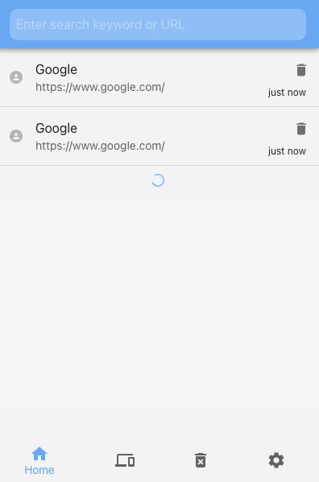

<p align="center">
    
</p>
<h2 align="center">
  Frontend Challenge: history tracker
</h2>

The CEDE Engineering Team appreciates your interest.
The tasks from this repository are used for all levels of frontend engineering roles.

### 🏗️ To do:
- complete the coding tasks
- upload the code to your personal github repo
- share the link to your repo

---
### ✨ Features

- Quickly access you history in popup without going away from your working tab.
- Delete specific or all history
- Reopen closed tabs (Full sessions)
- Restore sessions from other devices
- Infinite scrolling

### ⌨ Keyboard Shortcuts

- 🔵 Toggle history tracker (Open/Close extension popup) - <kbd>Ctrl + Shift + H</kbd>

In the Popup

- ⚙️ Open extension options/settings - <kbd>Alt + O</kbd>
- 📑 See recently closed tabs/other tabs - <kbd>Alt + T</kbd>
- 🔙 Switch back to view history from recently closed/other tabs - <kbd>Alt + H</kbd>
- 🔢 After opening the popup you can use number keys <kbd>Alt + (1 - 9)</kbd> to open the nth number of history link or recently closed tab.

> 💡 **Tip:** Replace Alt key with Option on Mac.

---

## Getting Started
This repository contains a Chrome extension build with React, Redux & MUI.

You can follow the instruction below to launch the extension.
1. Install dependencies using and build the extension `yarn && yarn start`
2. Type in the address bar ```chrome://extensions```
3. Toggle **developer mode** on the top right
4. Click on **Load unpacked** button and choose your freshly built ```dist/``` folder 

### Exercise 1: Add instant search capabilities
> 🔎 As a user, I want to quickly search in history - <kbd>Alt + S</kbd>
 <p float="left">
  
   
  
</p>


### Exercise 2: Delete my history
> As user, I want to delete my history as follows on the screen.
> You can use dispatch actions ```deleteAll``` and ```deleteRange``` functions from ```thunks.ts```.


### Exercise 3: Unit tests & documentation
> 🧪 Write unit tests for your code.
 
> 🎨 Setup storybook and add some relevant components
---
<h2 align="center">
  🔥 Good luck!
</h2>
